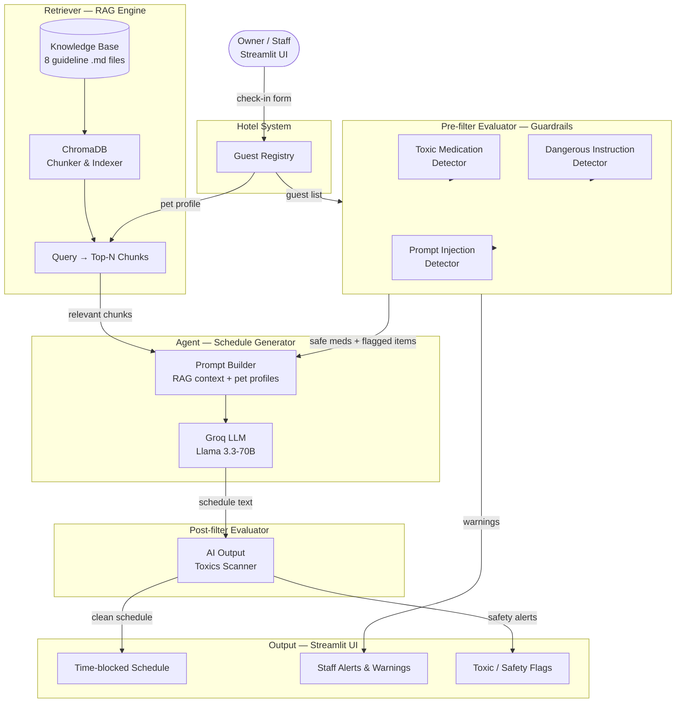

# System Architecture

```mermaid
flowchart TD
    A([Owner / Staff\nStreamlit UI])

    subgraph Hotel["Hotel System"]
        B[Guest Registry]
    end

    subgraph RAG["Retriever — RAG Engine"]
        C[(Knowledge Base\n8 guideline .md files)]
        D[ChromaDB\nChunker & Indexer]
        E[Query → Top-N Chunks]
        C --> D --> E
    end

    subgraph Guard["Pre-filter Evaluator — Guardrails"]
        F[Toxic Medication\nDetector]
        G[Dangerous Instruction\nDetector]
        H[Prompt Injection\nDetector]
    end

    subgraph Agent["Agent — Schedule Generator"]
        I[Prompt Builder\nRAG context + pet profiles]
        J[Groq LLM\nLlama 3.3-70B]
        I --> J
    end

    subgraph Post["Post-filter Evaluator"]
        K[AI Output\nToxics Scanner]
    end

    subgraph Out["Output — Streamlit UI"]
        L[Time-blocked Schedule]
        M[Staff Alerts & Warnings]
        N[Toxic / Safety Flags]
    end

    A -->|check-in form| B
    B -->|pet profile| E
    B -->|guest list| Guard
    E -->|relevant chunks| I
    F --> Guard
    G --> Guard
    H --> Guard
    Guard -->|safe meds + flagged items| I
    Guard -->|warnings| M
    J -->|schedule text| K
    K -->|clean schedule| L
    K -->|safety alerts| N
```
