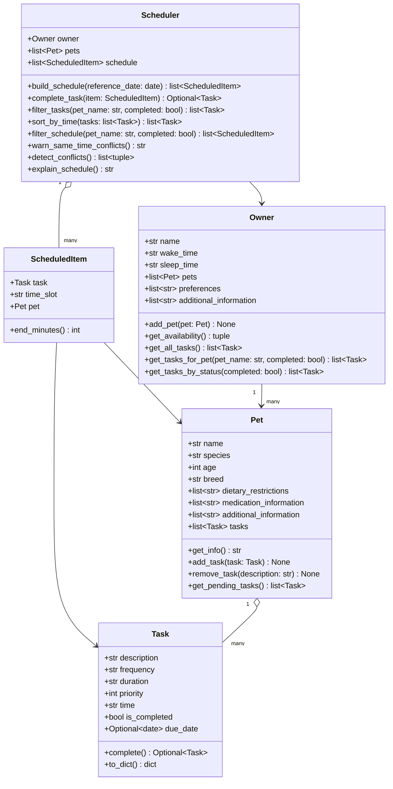

```mermaid
classDiagram
    class Pet {
        +str name
        +str species
        +int age
        +str breed
        +list~str~ dietary_restrictions
        +list~str~ medication_information
        +list~str~ additional_information
        +list~Task~ tasks
        +get_info() str
        +add_task(task: Task) None
        +remove_task(description: str) None
        +get_pending_tasks() list~Task~
    }

    class Owner {
        +str name
        +str wake_time
        +str sleep_time
        +list~Pet~ pets
        +list~str~ preferences
        +list~str~ additional_information
        +add_pet(pet: Pet) None
        +get_availability() tuple
        +get_all_tasks() list~Task~
        +get_tasks_for_pet(pet_name: str, completed: bool) list~Task~
        +get_tasks_by_status(completed: bool) list~Task~
    }

    class Task {
        +str description
        +str frequency
        +str duration
        +int priority
        +str time
        +bool is_completed
        +Optional~date~ due_date
        +complete() Optional~Task~
        +to_dict() dict
    }

    class ScheduledItem {
        +Task task
        +str time_slot
        +Pet pet
        +end_minutes() int
    }

    class Scheduler {
        +Owner owner
        +list~Pet~ pets
        +list~ScheduledItem~ schedule
        +build_schedule(reference_date: date) list~ScheduledItem~
        +complete_task(item: ScheduledItem) Optional~Task~
        +filter_tasks(pet_name: str, completed: bool) list~Task~
        +sort_by_time(tasks: list~Task~) list~Task~
        +filter_schedule(pet_name: str, completed: bool) list~ScheduledItem~
        +warn_same_time_conflicts() str
        +detect_conflicts() list~tuple~
        +explain_schedule() str
    }

    Scheduler --> Owner
    Scheduler "1" o-- "many" ScheduledItem
    ScheduledItem --> Task
    ScheduledItem --> Pet
    Owner "1" --> "many" Pet
    Pet "1" o-- "many" Task
```
