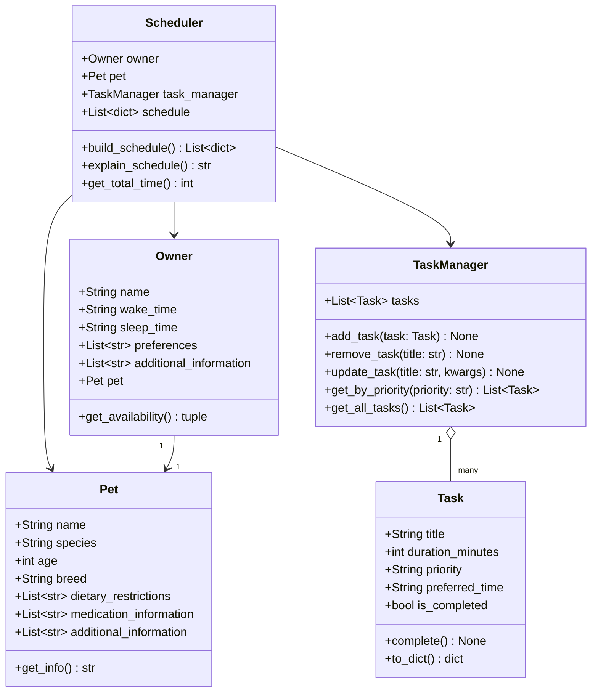

```mermaid
classDiagram
    class Pet {
        +String name
        +String species
        +int age
        +String breed
        +List~str~ dietary_restrictions
        +List~str~ medication_information
        +List~str~ additional_information
        +get_info() str
    }

    class Owner {
        +String name
        +String wake_time
        +String sleep_time
        +List~str~ preferences
        +List~str~ additional_information
        +Pet pet
        +get_availability() tuple
    }

    class Task {
        +String title
        +int duration_minutes
        +String priority
        +String preferred_time
        +bool is_completed
        +complete() None
        +to_dict() dict
    }

    class TaskManager {
        +List~Task~ tasks
        +add_task(task: Task) None
        +remove_task(title: str) None
        +update_task(title: str, kwargs) None
        +get_by_priority(priority: str) List~Task~
        +get_all_tasks() List~Task~
    }

    class Scheduler {
        +Owner owner
        +Pet pet
        +TaskManager task_manager
        +List~dict~ schedule
        +build_schedule() List~dict~
        +explain_schedule() str
        +get_total_time() int
    }

    Scheduler --> Owner
    Scheduler --> Pet
    Scheduler --> TaskManager
    TaskManager "1" o-- "many" Task
    Owner "1" --> "1" Pet
```
